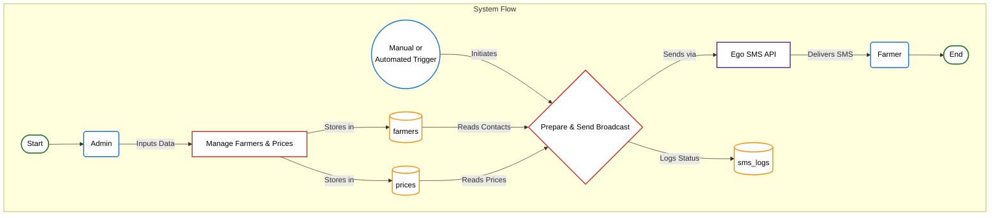

# SMS Market Price Alert System - Data Flow Diagram (DFD)

This document contains the Data Flow Diagram (DFD) for the system. It illustrates how data moves between the system's processes, data stores (database tables), and external entities (Admin, Farmer, Cron Job).

## Mermaid DFD

This diagram shows the high-level flow of data through the system, from initial data entry by the administrator to the final SMS received by the farmer.

### Diagram Key

*   **External Entity** (Rectangle with rounded corners, light blue): An actor outside the system that sends or receives data.
    *   `Admin`: The system administrator.
    *   `Trigger`: Represents either a manual action by the Admin or an automated trigger from a Cron Job.
    *   `Farmer`: The end-user receiving the SMS.
    *   `Ego SMS API`: The external service used for sending messages.
*   **Process** (Rectangle): A function or process that transforms data.
    *   `Handle Login`, `Manage Farmers`, `Manage Prices`, `Broadcast SMS`, `Send via API`, `Log Broadcast Status`.
*   **Data Store** (Cylinder, light purple): A database table where data is stored.
    *   `admins`, `farmers`, `prices`, `sms_logs`.
*   **Data Flow** (Arrow): The movement of data between other elements.

### Workflow Explanation

1.  **Data Input**: The `Admin` logs in and inputs data for farmers and market prices. This information is stored in the `farmers` and `prices` tables respectively.
2.  **Broadcast Trigger**: A broadcast can be initiated either manually by the `Admin` or automatically by a scheduled `Cron Job`.
3.  **Data Processing**: The `Broadcast SMS` process gathers the latest price information and the list of farmer phone numbers from the database.
4.  **Data Output**: It formats the message and sends it to the `Ego SMS API`, which then delivers the SMS to the `Farmer`.
5.  **Logging**: The outcome of the broadcast (e.g., "success") is recorded in the `sms_logs` table for auditing purposes.