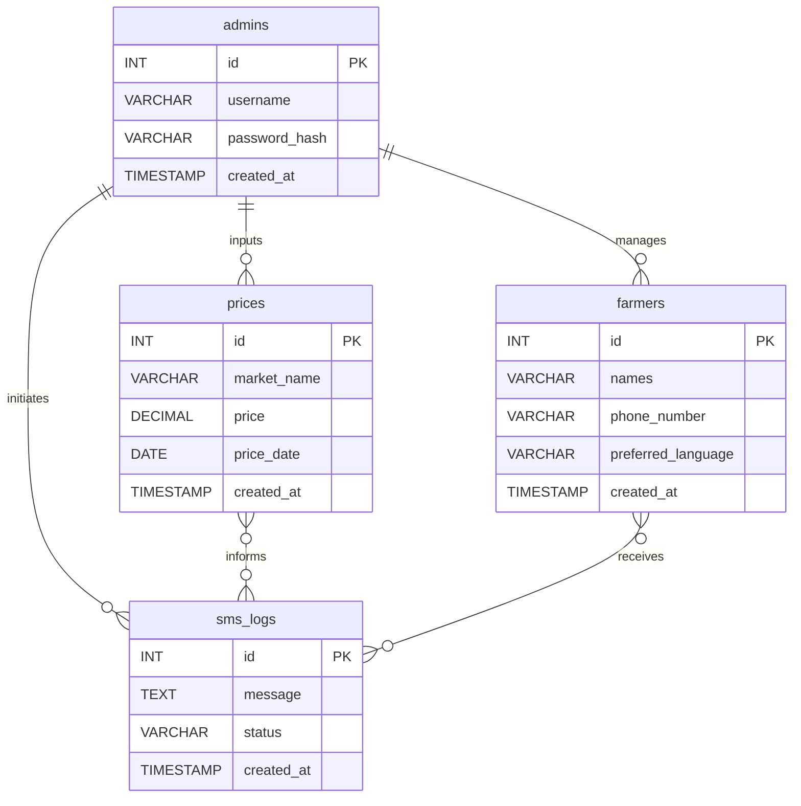

# SMS Market Price Alert System - ERD

This document contains the Entity-Relationship Diagram (ERD) for the database. It illustrates the tables and the logical relationships between them.

The relationships shown here are primarily managed through the application logic rather than being enforced by foreign key constraints in the database schema.

## Mermaid ERD

### Relationship Explanations

*   **`admins` to `farmers`**: An admin registers and manages many farmers.
*   **`admins` to `prices`**: An admin inputs many market prices.
*   **`admins` to `sms_logs`**: An admin's action (like a broadcast) initiates the creation of SMS logs.
*   **`prices` to `sms_logs`**: The data from the `prices` table is used to compose the message stored in `sms_logs`.
*   **`prices` to `sms_logs`**: The price data (per kg and per sack) is used to compose the message stored in `sms_logs`.
*   **`farmers` to `sms_logs`**: An SMS log is created for each message sent to a farmer.